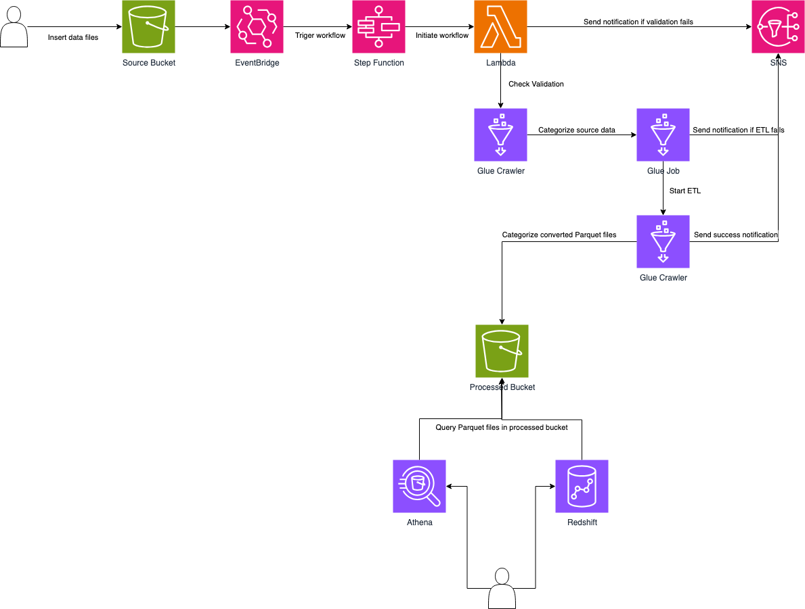

# Retail Store Multi-Format Data Processing Pipeline

## 📌 Project Overview
The **Retail Store Multi-Format Data Processing Pipeline** is a **serverless, AWS-based data integration platform** designed to automatically transform various types of retail transaction data into analytics-ready formats.  

It solves a key challenge in modern retail: **efficiently processing and analyzing sales data from multiple sources and formats** without managing complex infrastructure.

### ✨ Key Features
- **Automated data processing** for multiple file formats:
  - CSV
  - JSON
- **Secure & scalable data storage**
  - Raw data stored in **Amazon S3** with version control
  - Processed data stored in **Parquet** format for optimized analytics
- **End-to-end serverless pipeline**
  - Event-driven workflows with **Amazon EventBridge**
  - Orchestration with **AWS Step Functions**
  - ETL with **AWS Glue**
- **Real-time monitoring & alerting**
  - **Amazon SNS** for success/failure notifications
  - **Amazon CloudWatch** for logs & metrics
- **Analytics-ready data**
  - **Amazon Athena** for cost-effective SQL queries
  - **Amazon Redshift Serverless** for advanced analytics

---

## 🏗️ Architecture Overview

### Components
- **S3 Buckets**
  - Source bucket: raw CSV/JSON
  - Processed bucket: partitioned Parquet files
- **Lambda**
  - `file_validator`: checks format & triggers Step Functions
- **Glue**
  - Crawler: catalogs data
  - ETL job: transforms data to Parquet
  - Data Catalog: supports Athena/Redshift queries
- **Redshift Serverless**
  - Complex analytical queries
- **Athena**
  - SQL queries on Parquet files
- **EventBridge**
  - Triggers workflows
- **SNS**
  - Notifications
- **CloudWatch**
  - Monitoring & metrics

---

## 🔄 Processing Flow
1. **Data Ingestion**  
   Uploading files (CSV, JSON) to the S3 source bucket triggers **EventBridge** and starts the pipeline.  

2. **ETL Transformation**  
   AWS Glue validates, transforms, and converts raw data into **standardized Parquet format**, partitioned for efficient querying.  

3. **Analytics & Querying**  
   - **Athena**: SQL queries directly on S3 Parquet data.  
   - **Redshift Spectrum**: complex analytical queries for deep insights.  

4. **Error Handling & Alerts**  
   - **S3 versioning** ensures data recovery.  
   - **SNS + CloudWatch** send alerts for ETL failures.  

---

## 🚀 Potential Integrations
- **Amazon SageMaker**: build recommendation systems & predictive models.  
- **Amazon QuickSight**: interactive dashboards & visual analytics.  
- **AWS Lake Formation**: fine-grained access control & data governance.  

---

## 💡 Use Cases
- Small businesses transforming **daily transaction records** into insights.  
- Originally designed for **bookstores**, but adaptable for **any retail or service business**.  
- Makes **enterprise-level data processing accessible** without infrastructure management.  

---

---

## ⚡ Getting Started
1. Upload transaction files (`CSV`, `JSON`) to the **S3 source bucket**.  
2. The pipeline will automatically:
   - Validate the file format  
   - Trigger ETL jobs  
   - Store processed data in Parquet format  
3. Query transformed data via **Athena** or **Redshift**.  

---

